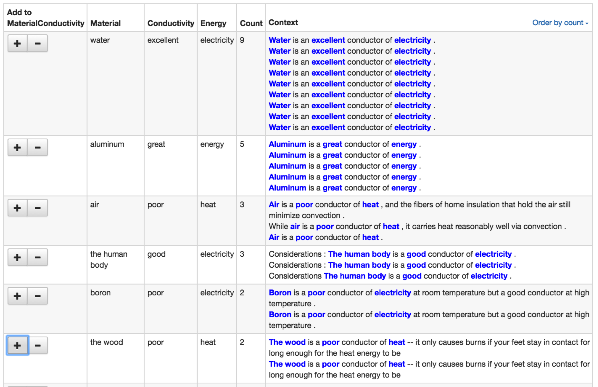
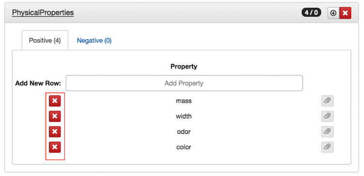
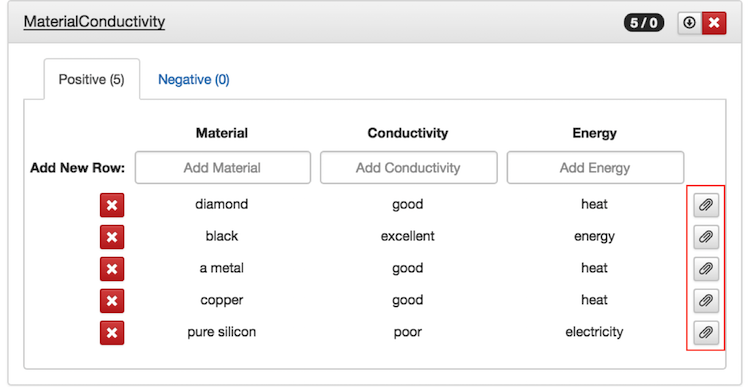
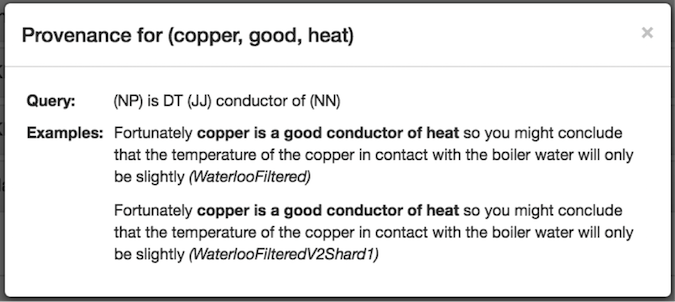
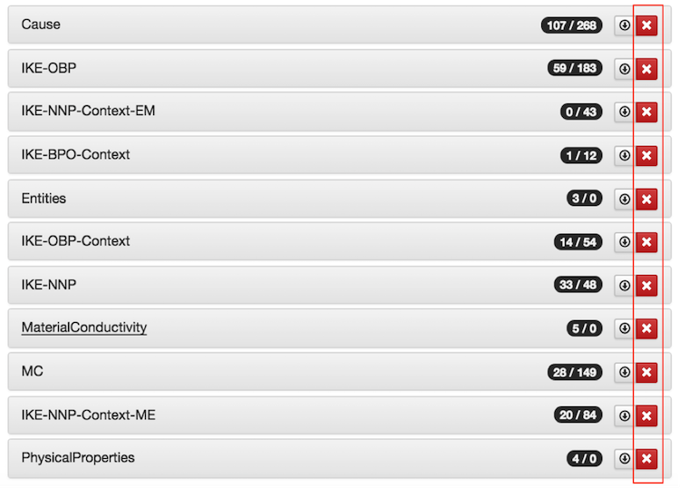
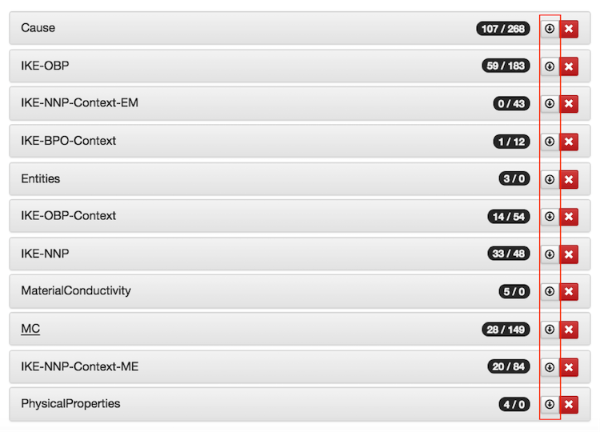

IKE Getting Started Guide
=========================

The IKE (Interactive Knowledge Extraction) tool helps you build tables of information by extracting facts from text via a simple and effective query language. The query language is built on top of BlackLab, an open-source retrieval engine. IKE lets you issue queries based on lexical and syntactic features in text and proposes extractions based on these queries, which can be used for interactive table building.

This guide will help a new user to quickly start building tables in the IKE web app.

**To begin using IKE**, you will need to first sign into IKE using a Google account, by clicking on the 'Sign In' button at the top right of the web app.
The first time you sign in, you will be prompted to explicitly grant IKE permissions to use the specified Google account. Subsequently you will be able to sign in with the same account with a single click.

#Steps to create and build a table

#### 1. Create your target table

Go to the Tables tab.
For each column required in the target table, create the column by entering the column name in the 'Add column' field, and clicking on the '+' button. This creates the required columns.
Enter the table name and click the 'Create Table' button.

For example, suppose we wanted to record facts about the conductivity of different materials. We could create a table called `MaterialConductivity` with the columns: `Material`, `Conductivity`, `Energy`.


#### 2. Populate your table

Go to the Search tab.
Choose your target table from the dropdown—this would be `MaterialConductivity` in our example.
In the Query textbox, type in a query like:
```
(NP) is DT (JJ) conductor of (NN)
```
This will present some candidate extractions in the Search results:



Add entries to the `MaterialConductivity` table by clicking on the either the “+” or the “-” button under the ‘Add to MaterialConductivity’ column.  
If the extraction looks good, can click on the “+” button to add it to your list of Positive table entries. 
If you would like to record an extraction as a negative example, you can click on the “-” button to add it to your list of Negative table entries.  
The positive and negative examples are used by the Query Suggest feature explained later, to make sensible suggestions to narrow or broaden a query.

You can view a table’s contents by going to the Tables tab and expanding the required table name. 

#Named Patterns

If you have patterns you are likely to use frequently in your queries, you can store them as Named Patterns (under the Patterns tab), and refer to them in your search queries.

For example, you could define a named pattern Noun as the disjunction `{NN, NNS, NNP, NNPS}`:


You can then refer to it in queries in the Search tab as #Noun. Sample query using custom pattern: 
```
(#Noun) {is, are} DT (JJ) conductor of (#Noun)
```
	
#Expanding a table via bootstrapping

One approach to build tables is to start with a table with some seed entries, and then expand it. The IKE query syntax supports queries based on distributional similarity using word2vec. Here is an example of a table built via bootstrapping.

Let’s suppose that we wanted to build a table of entities and the associated physical properties they can have, for example, matter can have mass, weight, volume etc., light can have brightness, frequency, color etc., and sound can have volume, wavelength, frequency, and so on. 

Below are steps to build this table using bootstrapping.

#### 1. Expand seed list 

Start with a seed list of entries for physical properties (created by hand), and expand the list (single-column table) to a much larger set of possible properties.

> a. Create a single column table PhysicalProperties with 5 seed entries: 

* color
* odor
* width
* mass
* volume

You can enter table rows manually by expanding the required target table in the Tables tab and entering into the text fields to create new rows. 

> b. Use a search query to expand the existing set to a much larger set of properties:

```
$PhysicalProperties.Property ~ 100
```

This will propose some good and some bad candidates from which you can add entries that look good.  Entries already present in the table will have the “+” button pre-selected.

> c. Add additional positive examples from the search results by using the “+” button.

> d. Iterate over steps b and c to progressively expand the list. You will notice that the proposed extractions get better with each iteration because the seed set of entries gets progressively better and more representative of the class of things we are looking for.

> e. You could optionally do the same with the entities. For e.g., you can create an Entities table with a seed set of entries *like
* matter
* light
* sound
and iteratively expand the list.


#### 2. Create a target table

Once you have a good and large enough set of physical properties, create a table `EntityPhysicalProperties` with two columns: `Entity` and `Property`.


#### 3. Populate target table using expanded list(s)
 
Use the expanded set of properties to find properties of entities and put results into target table `EntityPhysicalProperties`.

You can use a query like: 
```
($PhysicalProperties.Property) of (NN)
```

#Query Suggestor

You can use IKE’S ML-based Query Suggestor to propose improved queries. This module performs a depth-limited beam search to explore the space of query variants, evaluated on the user-annotated examples collected so far. Variants are generated by broadening/narrowing a query.
					
Narrowing a query involves searching the space of restrictions on the current query, e.g., replacing a POS tag with a specific word, adding prefixes or suffixes to the query, adjusting distributional similarity based queries etc. Similarly, the broaden feature generalizes the given user query e.g. replacing a word by its POS tag. 			
			
After typing in your query, you can view suggestions by clicking on the Narrow/Broaden buttons to the right of the search box in the Search tab.

Note: The Query Suggestor does not currently work with table expansion queries (queries of the form `$PhysicalProperties.Property ~ 100`).

#View, Delete and Download Tables

##View Table, Add/Delete Rows

You can browse the content of your tables by going to the Tables tab and expanding the required table. The “x” button at the left of each row lets you delete a row:




The empty fields at the top of the existing rows let you add a new row:


You can also view the query and provenance of a row by clicking on the paperclip icon to the right of the row. 



Clicking on the above button will show the information pertaining to the row, as in this example about the “copper” row:



##Delete Table

You can click on the “x” button next to the table name to delete it:



##Download Table

You can also download a table as a TSV file by clicking on the download button next to the delete button:



The TSV file will included the tab-separated content of the table rows, as well as the row-wise provenance, which is a JSON structure containing the following information for each hit that led to a particular row (extraction):

Source corpus for the hit
Lexical and syntactic attributes of the tokens within a window of ~30 tokens surrounding the extracted words in the corpus
Search query used to produce the row

Sample provenance for a row:
```
{"query":"(NP) is DT (JJ) conductor of (NN)",
"context":[{"fragment":"Fortunately copper is a good conductor of heat so you might conclude that the temperature of the copper in contact with the boiler water will only be slightly",
"words":[{"word":"Fortunately",
"attributes":{"chunk":"BE-ADVP","lemma":"fortunately","pos":"RB","punct":""}},
{"word":"copper","attributes":{"chunk":"BE-NP","lemma":"copper","pos":"NN","punct":" 
"}},{"word":"is","attributes":{"chunk":"BE-VP","lemma":"be","pos":"VBZ","punct":" 
"}},{"word":"a","attributes":{"chunk":"B-NP","lemma":"a","pos":"DT","punct":" 
"}},{"word":"good","attributes":{"chunk":"I-NP","lemma":"good","pos":"JJ","punct":" 
"}},{"word":"conductor","attributes":{"chunk":"E-NP","lemma":"conductor","pos":"NN","punct":" 
"}},{"word":"of","attributes":{"chunk":"BE-PP","lemma":"of","pos":"IN","punct":" 
"}},{"word":"heat","attributes":{"chunk":"BE-NP","lemma":"heat","pos":"NN","punct":" 
"}},{"word":"so","attributes":{"chunk":"BE-SBAR","lemma":"so","pos":"IN","punct":" 
"}},{"word":"you","attributes":{"chunk":"BE-NP","lemma":"you","pos":"PRP","punct":" 
"}},{"word":"might","attributes":{"chunk":"B-VP","lemma":"might","pos":"MD","punct":" 
"}},{"word":"conclude","attributes":{"chunk":"E-VP","lemma":"conclude","pos":"VB","punct":" 
"}},{"word":"that","attributes":{"chunk":"BE-PP","lemma":"that","pos":"IN","punct":" 
"}},{"word":"the","attributes":{"chunk":"B-NP","lemma":"the","pos":"DT","punct":" 
"}},{"word":"temperature","attributes":{"chunk":"E-NP","lemma":"temperature","pos":"NN","punct":" 
"}},{"word":"of","attributes":{"chunk":"BE-PP","lemma":"of","pos":"IN","punct":" 
"}},{"word":"the","attributes":{"chunk":"B-NP","lemma":"the","pos":"DT","punct":" 
"}},{"word":"copper","attributes":{"chunk":"E-NP","lemma":"copper","pos":"NN","punct":" 
"}},{"word":"in","attributes":{"chunk":"BE-PP","lemma":"in","pos":"IN","punct":" 
"}},{"word":"contact","attributes":{"chunk":"BE-NP","lemma":"contact","pos":"NN","punct":" 
"}},{"word":"with","attributes":{"chunk":"BE-PP","lemma":"with","pos":"IN","punct":" 
"}},{"word":"the","attributes":{"chunk":"B-NP","lemma":"the","pos":"DT","punct":" 
"}},{"word":"boiler","attributes":{"chunk":"I-NP","lemma":"boiler","pos":"NN","punct":" 
"}},{"word":"water","attributes":{"chunk":"E-NP","lemma":"water","pos":"NN","punct":" 
"}},{"word":"will","attributes":{"chunk":"B-VP","lemma":"will","pos":"MD","punct":" 
"}},{"word":"only","attributes":{"chunk":"I-VP","lemma":"only","pos":"RB","punct":" 
"}},{"word":"be","attributes":{"chunk":"E-VP","lemma":"be","pos":"VB","punct":" 
"}},{"word":"slightly","attributes":{"chunk":"B-ADJP","lemma":"slightly","pos":"RB","punct":" 
"}}],"matchOffset":[1,8],"corpus":"WaterlooFiltered"}
```

#Supported Browsers

Use latest Desktop version of Safari, Chrome or Opera to view and work with IKE. IKE does not currently work on other browsers.
We have a known issue with the first sign-in on Firefox. If it appears that your initial sign-in via Google OAuth did not succeed, refreshing the page might help.
